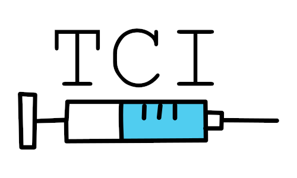

# Tony's Convenience Injector



It is a memory and code injector 💉 tool for the DayZ Standalone server. It allows for :

+ Lua scripting 💻
+ Hot reloading ♨️ the code
+ Faster iteration ⏱️ and debugging 🐛
+ Mod interop 🔀
+ Persistent Database Storage 🗄️

## Purpose
Writing serverside code for DayZ can be quite tedious because for every modification that requires testing, one has to reload the server and rejoin it. This can become very cumbersome.

TCI is developed for fast prototyping but it can also be used as a permanent scripting solution. The code can be reloaded on the fly, without even kicking the players out of the server.

I personally enjoy DayZ Standalone a lot as a game and I wish for more content to be made. The potential for serverside content creation is endless, but the tools given to server owners might deter people from reaching it. I hope that by making it easier for server owners and scripters to create content, more people will enjoy the game.

## Disclaimer
+ This is **not a cheat** and **cannot be used as a cheat**. 
+ It does **not** alter the DayZ Standalone **client**.
+ It does **not** alter the DayZ Standalone **network protocol**.
+ The code for TCI itself is open source.

Also :
+ From the client's perspective, there is **no difference** between a vanilla server and a server running TCI.
+ Ultimately, it works by calling EnfusionScript code that is meant to be used for modding.
+ It does not require any clientside mod to work.
+ Anything that is doable with TCI can be done without it, with pure EnfusionScript (just probably not that quickly).

The project is in its **early alpha**. Expect glitches.

## Script examples

```
function cutGas(playerID)
	car = GetPlayerCar(playerID)
	SetCarFuel(car, 0)
end
RegisterCommandHandler("/cutGas", cutGas)
```
This implements a chat command **/cutGas** that empties the fuel tank of whatever vehicle you are inside of when running it.

```
function policeGear(playerID)
    SpawnPlayerItem(playerID, "MakarovIJ70", 1, true)
    SpawnPlayerItem(playerID, "Mag_IJ70_8Rnd", 2, true)
    SpawnPlayerItem(playerID, "AmmoBox_380_35rnd", 1, true)
    SpawnPlayerItem(playerID, "Handcuffs", 1, true)
    SpawnPlayerItem(playerID, "HandcuffKeys", 1, true)

    SpawnPlayerItem(playerID, "PoliceCap", 1, false)
    SpawnPlayerItem(playerID, "PoliceJacket", 1, false)
    SpawnPlayerItem(playerID, "PolicePants", 1, false)
    SpawnPlayerItem(playerID, "DressShoes_Black", 1, false)
    SpawnPlayerItem(playerID, "PoliceVest", 1, false)

    SpawnPlayerItem(playerID, "PersonalRadio", 1, true)
    SpawnPlayerItem(playerID, "Battery9V", 2, true)
    SpawnPlayerItem(playerID, "Flashlight", 1, true)
    
    SendPlayerMessage(player, "Guns and ammo dispatched!")
end
RegisterCommandHandler("/policeGear", policeGear)
```
This **/policeGear** command gives you a full set of police gear. The last parameter of **SpawnPlayerItem** is a boolean indicating if the item should be spawned in-inventory or on-the-ground.


## Can I still use EnfusionScript alongside it?
Yes.

It is designed to not complicate writing EnfusionScript code, and you can do it alongside TCI with no problems.

## What else can it do?
[Click here for the API](docfiles/api.md).

## How to install?
[Click here for the install instructions](docfiles/hti.md).

## How does it work?
[Check this doc here](docfiles/hdiw.md).

## How was it made?
[Click here for the story](docfiles/story.md).

## Maintenance Guide
[Click here for the maintenance guide](docfiles/maintenance.md).

## Discord server
[Join our Discord here](https://discord.gg/3vs8S27kyV).

## How can I contribute?
Right now I still have to clean the code. You can contribute by giving this repository a star on GitHub, joining the Discord server and trying out the tool by writing some Lua scripts.

## Credits

Special thanks to [sinipelto](https://github.com/sinipelto) for the code [here](https://github.com/sinipelto/dayz-scripts) that implements really useful serverside admin commands and command handling in EnfusionScript.
