# 🛠️ Regular Maintenance Guide 🛠️

## The problem
Each time DayZ Server gets updated, TCI needs to be updated in order to inject correctly.

`detour.cpp` contains a `CreateDetour()` function, inside it there is an address that needs to be updated :

```
const uint64_t relativeAddrFuncA = 0x2ABACB; // for DayZ 1.20.155814
```

## The solution

### Requirements
+ Visual Studio set up to compile the DLL
+ Cheat Engine to issue a break and trace log

### Instructions

1) Boot the server ( DayZServer_x64.exe ) without the injector ( as you would boot vanilla ).
2) Boot Cheat Engine and attach to the DayZServer_x64.exe process.
3) Initiate a search for the following array of bytes :  `013BABE1B3BCAFF2E31B26987372BCAD`
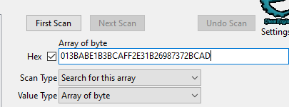
4) Right click on the result ( should be only one address on the left side ) and click Browse this memory region.
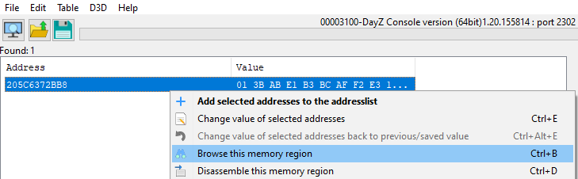
5. Look in the bottom pane ( memory view ) you should be able to identify the watermark. ( Shown in red in the picture below )
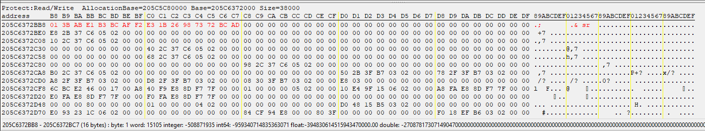
6. Scroll upwards a little bit to find the following sequence (highlighted in red) :
`FA000000 FB000000 FC000000 FD000000`
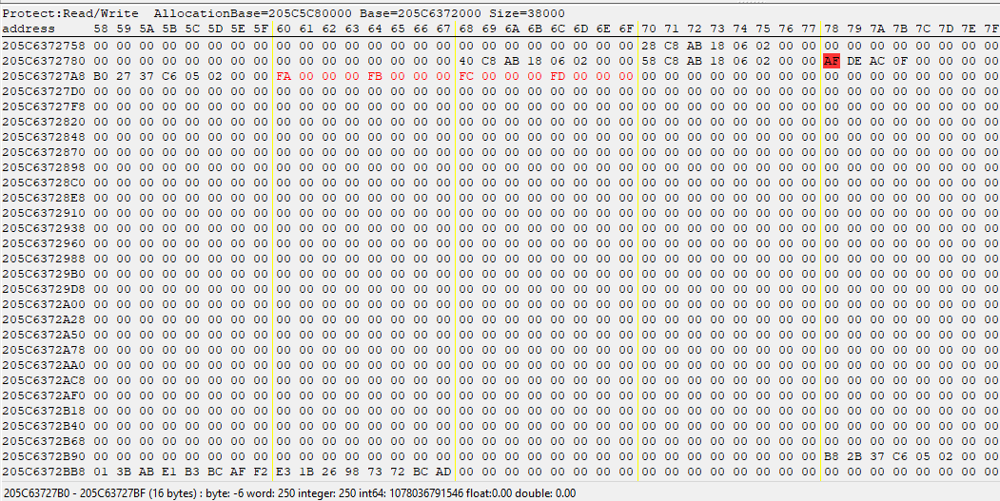
(note that the picture above also contains the watermark in the bottom-right corner still, so you don't have to scroll very much)
7. Right click on the byte `FA` from the sequence above > Data Breakpoint > Break and trace
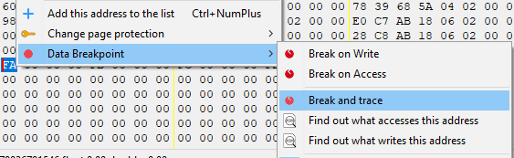
8. In the tracer window, hit File > New Trace
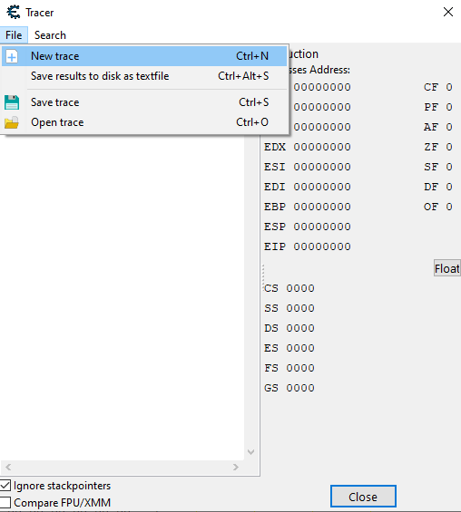
9. Use the following settings:
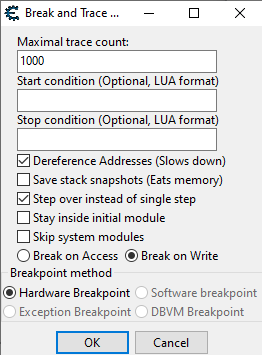
10. Save the trace :
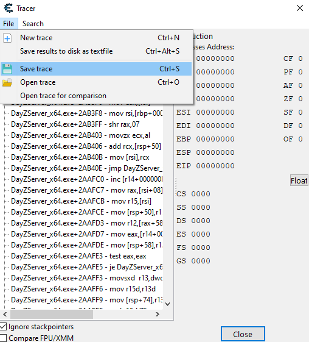
11. Open it with a text editor like VSCode. (It might complain about the file being binary, but open it with the text editor anyway).
12. I have prepared a trace you can compare against. Download it from [here](/maintenance/tutorial-trace.cetrace) and open it up in the left hand side and have your trace on the right hand side.
13. In the downloaded trace, press CTRL+F to look for the address marked at the beginning of that file.
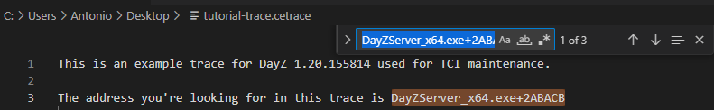
14. Go to the first occurence of that address and locate the line in the trace and instruction on the right side.
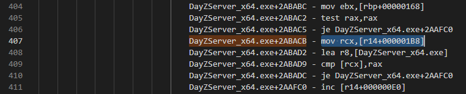
(The instruction is at line 407 in the trace and the assembly for it is `mov rcx,[r14+000001B8]`)
15. On the right hand side ( **your** trace ) either locate the same line number or look for the same assembly instruction with CTRL+F. You should be able to align both panes so that the assembly looks the same on both sides. Sometimes the exact assembly instruction might not match, so try looking for the same line number.
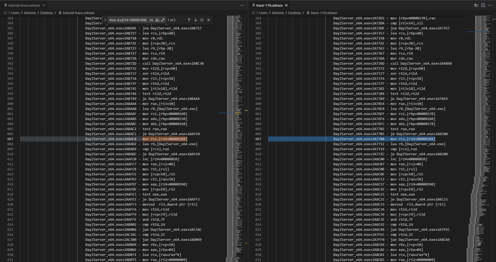
The address we were looking for was `2A770B`. Note this number
16. Now go in Visual Studio in TCI's source code. Navigate to the file `detour.cpp` and the function `CreateDetour()`. Update the following line with the number you've found. Don't forget the `0x` in front. It should look like this :
```
const uint64_t relativeAddrFuncA = 0x2A770B;
```
The DLL is ready to compile, but it is recommended you follow steps 17-21 below to assure that the bytes that get replaced are placed back correctly.
### Extra matching check
17. In Cheat Engine's memory viewer, go to the address you've found. To do that, with your mouse hovering the top pane ( assembly instructions pane ), press CTRL+G and type in DayZServer_x64.exe+{the number you've found} like DayZServer_x64.exe+2A770B. ( ⚠️While writing this tutorial my effective address was 2ABACB)
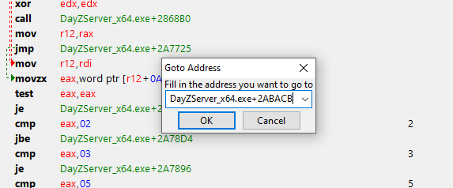
18. This should bring you somewhere that looks like this :
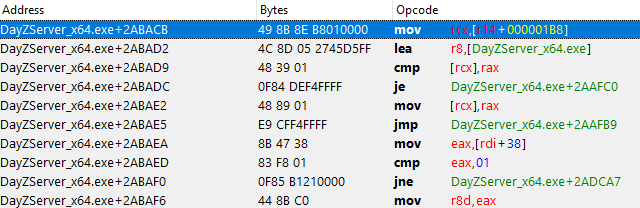
19. Note the bytes is in the second column : `49 8B 8E B8010000 | ... | 48 39 01`. ( We're only taking the bytes for the `mov` instruction and the `cmp` instruction. It is by design that we do not include the `lea` instruction bytes.)
20. Go in Visual Studio, in TCI's source code. Navigate to the same file `detour.cpp` and CTRL+F for the `dayzStolenBytes` char array. It might look like this :
```
char dayzStolenBytes[] = { 0x49, 0x8B, 0x8E, 0xB8, 0x01, 0x00, 0x00, 0x48, 0x39, 0x01 };
```
21. Make sure the `dayzStolenBytes` array matches what you've seen in Cheat Engine. If the bytes do not match, make sure to copy the exact bytes from Cheat Engine to `dayzStolenBytes`.

### Ready to compile!
22. Compile the DLL by right-clicking TCI-DLL in the Solution Explorer and hitting Build.
23. You can close Cheat Engine now.
24. Shut down the DayZ server.
25. Now you can boot with the autoinjector or injector of choice, and it should behave properly.

### Boot problems?
⚠️ Don't forget about the watermark file in `\AppData\Local\DayZ\`. At the moment of writing this doc it is called `testfile.txt` but the name might be subject to change. If there's such a file, delete it so the autoinjector will inject properly.