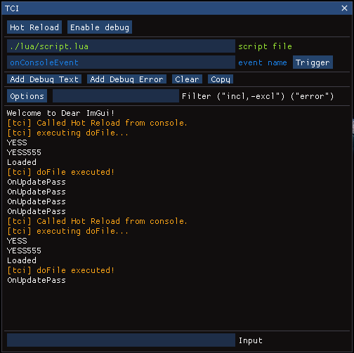

# The story of TCI

Hello. My name is Antonio and I've been playing DayZ Standalone since 2015. Since I first saw it on YouTube I knew I wanted to bring my own contribution to this already great game, and make it a little bit better. (Modding wasn't possbile back then).

A short time after the modding tools were released for DayZ, I started checking out the serverside scripting features. Everything was poorly documented back then, and I had to search a lot for the API to do certain things. There were forums with code snippets here and there but I felt like it was really complicated to write and test more complex behavior.

Having prior experience with C++, I tried to understand how the EnfusionScript interpeter works, and I attempted to print an array to a file (passing the name of the array variable with no indexing). Something like this:

```
int myArray[4];

FileHandle file = OpenFile("$profile:test.txt", FileMode.WRITE);
FPrintln(file, myArray);
CloseFile(file);
```

Because the symbolic `myArray` **had** to be typecasted to some printable format, I was expecting that the memory address would be printed to a file. AND IT WAS. The only caveat was that it was truncated to the least-significant 32 bits. Because the server is a 64-bit executable, that means only half of the address was printed on output. Apparently the interpeter's integer values are 32-bit only so it has a hard time dealing with 64. (You can actually see this if you look through the functions that require **long long int**s, they've split the parameters into **high int** and **low int**).

So, bytewise, instead of having the `HHHH HHHH LLLL LLLL` address, where each letter is one byte, I only had the `LLLL LLLL` part. 

Then I figured out that if I really want to find the full address, I can lay out some watermark in memory at that location and scan for the full `HHHH HHHH` range.

```
Checking every of the following addresses:
0000 0001 LLLL LLLL
0000 0002 LLLL LLLL
0000 0003 LLLL LLLL
...
FFFF FFFF LLLL LLLL

(2^32 of them)
```

Watermark would look like:
```
01 3B AB E1 B3 BC AF F2 E3 1B 26 98 73 72 BC AD
^^
HHHH LLLL
```

Encoded like this in C++ :
```
BYTE watermark[] = { 0x01, 0x3B, 0xAB, 0xE1, 0xB3, 0xBC, 0xAF, 0xF2, 0xE3, 0x1B, 0x26, 0x98, 0x73, 0x72, 0xBC, 0xAD };
```

To actually place the watermark in the server's memory, I could write this in EnfusionScript:

```
int DLL_WATERMARK[4];

DLL_WATERMARK[0] = -508871935;
DLL_WATERMARK[1] = -223363917;
DLL_WATERMARK[2] = -1742332957;
DLL_WATERMARK[3] = -1380158861;
```
The code above places the bytes in memory. The code itself has the values encoded as 4 signed 32-bit ints.

By using [ReadProcessMemory](https://learn.microsoft.com/en-us/windows/win32/api/memoryapi/nf-memoryapi-readprocessmemory) in C++, I could scan over the full memory range. And check the memory each time for the watermark.

Et voilà. I had it.

I had the exact memory address of my EnfusionScript array. I could do this for any array. And essentially.. I could access these EnfusionScript arrays externally with [WriteProcessMemory](https://learn.microsoft.com/en-us/windows/win32/api/memoryapi/nf-memoryapi-writeprocessmemory).

Then I took a break from this. I didn't have enough time to investigate the wonders of DayZ modding anymore.

After 2 years ish, as far as I remember, I had more time to work on DayZ content creation and I wanted to add [Lua](https://www.lua.org/) scripting support to DayZ, to speed up modding. I like Lua very much because it is easy to pick up and confortable to use.

I added the Lua VM to the C++ project. The idea was running Lua code that would tell C++ to modify an array in EnfusionScript.

```
Something like this:

Lua :
    CreateOlga(x,y,z)

-> C++:
    bridgeArray[0] = 420235; // some command code
    bridgeArray[1] = x;
    bridgeArray[2] = y;
    bridgeArray[3] = z;

-> EnfusionScript:
    if (bridgeArray[0] == 420235){ // code for 'CreateOlga'
        vector pos;

        pos[0] = bridgeArray[1];
        pos[1] = bridgeArray[2];
        pos[2] = bridgeArray[3];

        car = GetGame().CreateObject("CivilianSedan", pos);
    }
```

Ok, so now data data transmission between Lua and EnfusionScript was possible.
However, there was no way to reliably sync the two processes just by passing data through a common array. Take this code for example :

```
Lua :
    SpawnPlayerItem(playerID, "MakarovIJ70", 1, true)
    SpawnPlayerItem(playerID, "Mag_IJ70_8Rnd", 2, true)
    SpawnPlayerItem(playerID, "AmmoBox_380_35rnd", 1, true)
```

Lua would call 3 functions that need to execute all in the same 'frame'. Each Lua function would trigger a C++ function, that would place some data in the shared memory. But while executing Lua code, there would be no way to know how many more functions are ahead to be executed for that frame.

Let's say I could've created a system where all the items would be put in a queue that would be flushed at the end of the Lua execution for that particular frame. But that is not a general solution.

And then we have things such as :
```
Lua :
	car = GetPlayerCar(playerID)
	SetCarFuel(car, 0)
```

Here, the `GetPlayerCar` function returns a value for `car`. Then it calls `SetCarFuel` with that value as a parameter. So here the program control would have to be passed back and forth between Lua and EnfusionScript, and both threads would have to wait for each other.

For exactly this reason, I decided that something code-wise has to be done. (Because memory-wise we kinda reached a peak here).

So I decided to 'hijack' the EnfusionScript interpeter thread at key moments so I could pass control to Lua, then give control back and go back and forth as many times as needed. By working in-thread, and not with two separate threads, everything is naturally in-sync.

I fired up CheatEngine's debugger for this purpose. But I needed something to analyze on the server. So I wrote this code in EnfusionScript:

```
int DLL_BRIDGE_BYTES[4];

void PAYLOAD_FLIP(){
    DLL_BRIDGE_BYTES[0] = 10;//0xA;
    DLL_BRIDGE_BYTES[1] = 11;//0xB;
    DLL_BRIDGE_BYTES[2] = 12;//0xC;
    DLL_BRIDGE_BYTES[3] = 13;//0xD;

    DLL_BRIDGE_BYTES[0] = 250;//0xFA;
    DLL_BRIDGE_BYTES[1] = 251;//0xFB;
    EXTRA_FUNC_CALL();
    DLL_BRIDGE_BYTES[2] = 252;//0xFC;
    DLL_BRIDGE_BYTES[3] = 253;//0xFD;
}

void EXTRA_FUNC_CALL(){
    DLL_BRIDGE_BYTES[3] = 16777132;
}
```

The code above modifies some array values a couple of times. The values really don't matter. It also does a function call on `EXTRA_FUNC_CALL`.

Modifying an array's value is a very simple instruction to be done by a computer. (So its execution is not lengthy when looking through a run-down of what happened in the program - via a debug trace)

What I wanted to figure out is exactly the code region in the server's assembly that fires up when a function call happens in EnfusionScript. This is why I've snuck an `EXTRA_FUNC_CALL` in between the assignment instructions on that array.

Now of course, I needed something to actually call the code above, so I wrote this in the script init:
```
GetGame().GetCallQueue(CALL_CATEGORY_GAMEPLAY)
.CallLater(this.PAYLOAD_FLIP, 1000, true);
```
(It runs the `PAYLOAD_FLIP` function every 1 second)

Now, in CheatEngine's memory view, I pinpointed the exact location of the `DLL_BRIDGE_BYTES[0]` and placed a data breakpoint on it, and started a stack trace.
Basically, when the first instruction of `PAYLOAD_FLIP` executed, I would start getting a rundown of all the assembly instructions that would run afterwards.

Because the assignment instruction is repetitive (it executes 9 times per second in the code above) I could divide the resulting log into multiple pieces. The stack trace log is lenghty so I will not post it here. With it, I figured out what the assignment instruction looks like in assembly, what an ES function call looks like, and also an ES function return.

The stack trace looked like this:
```
END_OF_ASSIGNMENT_1 <- where my data breakpoint fired
ASSIGNMENT_2
ASSIGNMENT_3
ASSIGNMENT_4

ASSIGNMENT_5
ASSIGNMENT_6
FUNC_CALL
ASSIGNMENT_7
FUNC_CALL_RETURN
ASSIGNMENT_8
ASSIGNMENT_9
```
(There would be a list of assembly instructions, but again, it's very lengthy)

Because EnfusionScript is an *interpreted scripting language*, all the function calls pass through the exact assembly instructions, unlike C/C++ function calls. The only difference is the variables these instructions access. This holds true for every instruction the EnfusionScript virtual machine does.

So all the array assignments are done through the same bit of code on the server, which allowed me to divide the stack trace into pieces by correlating the assembly instructions to the EnfusionScript instructions and how many times they repeat in the analyzed code.

I was interested in the `FUNC_CALL` assembly. By placing a `jmp` instruction there I could detour the code execution to some of my own code, and then `jmp` back to the next instruction.

To get my own assembly code alongside the server code, I wrote a .dll in C++ and injected it. So now I was able to run some C++ each time a function fired in EnfusionScript.

*A lot of time passed by, improving the detour mechanism, writing logic, guarding the function calls so that they would maintain context after C++ code, and many other details too long to fit here...*

Because C++ code and EnfusionScript code were now executed in the same thread, control had to be passed from one to the other. But also, Lua is called by C++. And it can also call C++ itself.

In this project, there are three programming languages that execute their code sequentially, but they can be *interrupted* any time, and be able to resume from where they left.

(They do not get interrupted externally, but they have to **yield** control to the others)

Lua was made in such a way that this would be very simple between it and C++. It is fairly easy to write code and not ever worry about the yielding mechanism. Even if you call one Lua function from C++ and it calls 15 C++ functions in that call, it all works out well.

Having to interop between EnfusionScript, C++ and Lua, yielding became complicated.

I first considered Lua *coroutines* (which are a language feature) - specifically writing Lua code in such a way that would `yield` control to C++ when calling API functions. There is a built-in `yield` keyword in Lua for that. However, this had some caveats and I didn't want to overcomplicate the later development process.

Then I thought of C++20 coroutines, but after trying to work with them a bit, I realized I'd have to modify Lua itself for this strategy to work.

Both these solutions would've been single-threaded which would've been perfect, but practically they just didn't work in this use case.

I finally decided to make a separate thread that would wait for the main thread. And also the main thread would wait for the Lua thread.

*Condition variables are an efficient way to wait for other thread but for some unknown to me reason, they only work for the Lua thread to wait for the main thread, but not the other way around. So I had to fallback to using a busy-waiting while loop on the main thread. It should be fine as the main thread waits less often than the Lua thread that waits the majority of time.*

Even now, the Lua runs on a separate thread for context-preserving reasons.

*More time goes by, fixing small issues, writing the code as maintainable as possible, etc...*

I then implemented a simple GUI with imgui. It features a hot reload button for loading code on the fly and a console for printing console messages - which can come in handy while debugging.



After "finishing" a somewhat stable version, I decided to finally publish the code for people to use and enjoy. I postponed this for two months because I wanted to write the docs, make videos presenting the tool and explaining how it works, making a discord server, etc.

And that's the story... so far :D